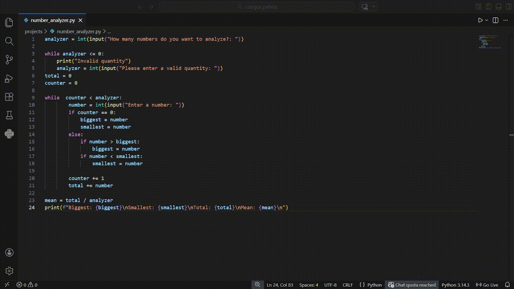

# 🔢 Number Analyzer - Python
A simple Python program that analyzes numbers, showing the maximum, minimum, sum, and average.

## 🚀 Features

- User-defined number of inputs
- Input validation (prevents invalid quantity)
- Calculates: Maximum value, minimum value, total sum, average (mean), clean and user-friendly output

## 🛠️ Technologies Used

- Python

## ▶️ How to Run

1. Clone the repository
git clone https://github.com/joaoleaodev/number-analyzer-python.git

2. Navigate to the folder
cd number-analyzer-python

3. Run the program
python number_analyzer.py

## 📚 What I Learned

This project helped me practice:

- Loops (`while`)
- Conditional logic (`if/else`)
- Variables and data handling
- Input validation
- Mathematical operations
- Problem-solving and logical thinking

## 🎥 Project Preview

  

## 📌 Future Improvements
- Store numbers using lists
- Show sorted numbers
- Count even and odd numbers
- Add error handling (try/except)
- Turn into reusable functions

## 👨‍💻 Author

<table>
  <tr>
    <td align="center">
      
    </td>
    <td>
      

        Graduando em <b>Engenharia de Software na FIAP</b>. 🚀
      

      

        Desenvolvedor focado em <b>Back-end (Java & Python)</b> e soluções eficientes.
      

      
    </td>
  </tr>
</table>

---

⭐ If you liked this project, feel free to give it a star!
